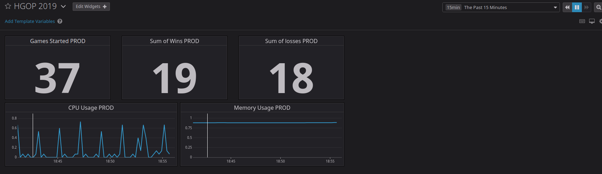

# HGOP

Hagnýt gæðastjórnun og prófanir

---

## URL
Url to the Jenkins instance
<a href="http://54.242.184.100:8080">**54.242.184.100:8080**</a>

---

## DataDog Dashboard
Public link to the <a href="https://p.datadoghq.eu/sb/n6h2d11xqrvy3hk8-4362905296babb451155fa0a01b40f37">**DataDog Dashboard**</a> showing the past week.

Screenshot of the DataDog Dashboard

We also invited HrafnOrri1207@gmail.com to our team in DataDog.

## Other

**Week 3**
* Few extra things that are in the project, script to start a local instance of the game. Test script for the tests.

**Week 2**
* We added a build status for the README for jenkins and can be seen above.

**Week 1**
* We made two scripts for the setup, one for Linux and one for MacOS, since we are using seperate operating systems on our PCs.